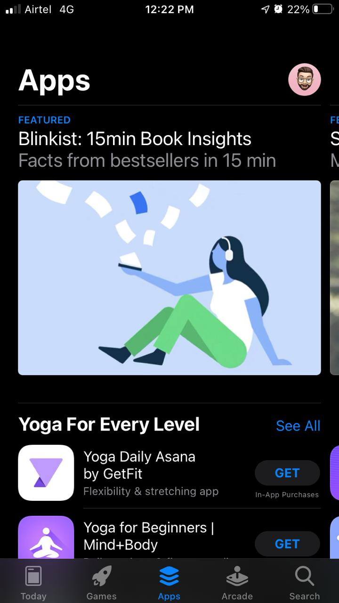
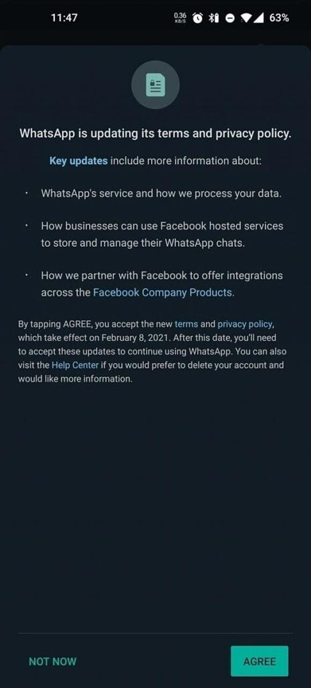
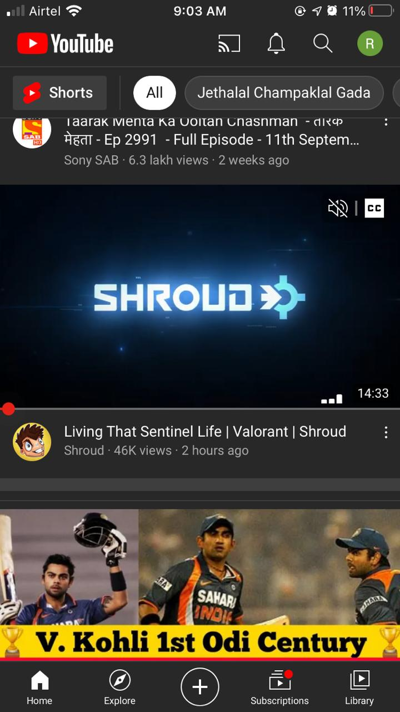
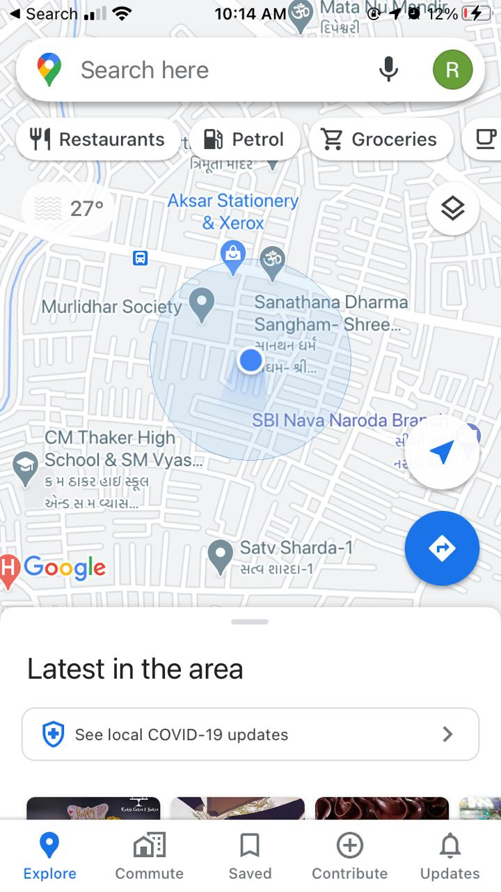
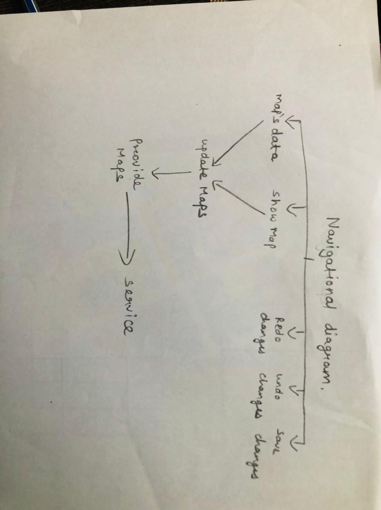

# 114-pp

## 0101

 As time goes by, some things become outdated and are no longer able to fit the modern standards of the word. This also applies to a digital world that is changing every minute. For example, new technologies, approaches, trends, and tools appear to help designers and developers improve their works and ease the creation process. That’s why some digital products, such as web or mobile applications, can easily “get old” one day as well as their user interface design. The best solution is to make a website’s/mobile app redesign or create a new one, as a last resort. As an example I always like websites which are attractive and decent as viewer's perspective like Apple which is one of the biggest company of the world has stole my heart because the contrast used by them in each application like appstore is one of best sorted app i have ever use which has no words its unbelievable and the X-factor of this website is that, it is convenient for lower to higher iphones. But, if I talk about an app which has a poor interface then I guess its whatsapp for me because as we know their new policy, they are sharing our data with facebook which means our important messages are no more end to end encrypted. Apart from privacy policy it was really great and also convenient having easy features which can use by all age person. 

## 0102

 Well, usability is a measure of how well a specific user in a specific context can use a product or design to achieve a defined goal effectively, efficiently and satisfactorily.And intuitive design is used informally to describe designs that are easy to use. So, when a user is able to understand and use a design immediately—that is, without consciously thinking about how to do it—we describe the design as “intuitive”. There are some elements for usability are checkboxes, icons, notifications and more like this intuitive elements are feedback, efficiency, forgiveness and many more. 

## 0201

 Chosen App:- Facebook
  It allows-
  -Microphone (when required)
  -Camera
  -Photos
  -Location while using application
  
  Features of Facebook-
  - Group chats
  - Events
  - GPS
  - Location 
  - Newsfeeds
  - Explore friends
  - Secure managed users
  - Memories
  - Donations
  - Facebook Gaming and many more.
 

 
 ## 0202
 
 

  Here I'm gonna talk about youtube because I'm using it since 2012. I always like the algorithm of youtube because it shows what I need.
  The home page of the youtube shows the several things like search bar at the top right, notification bar just left to it and at the bottom side there are five distributted sections named home, explore, plus, subscritions and library.
  Model-
  -History of your videos
  -Notification messages
  -Bottom navigation bar contains home, explore, plus, subscritions and library.
  -Videos contains number of views and tumbnail
  -Some sponsor ads
 View-
  -Search bar contains what I have searched before
  -Shorts icon shows the small videos like tiktok.
  -With the videos it shows the channel name and time span after the video got uploaded.
 Controller-
  -After clicking on video it shows like-dislike button and comment section.
  -We can also save the video by clicking on it which is just right of like-dislike button.
  -Trending videos of your region can seen by just clicking on explore button.
  -Subscriptions list is also available where you can watch of your choice by tapping on 4th button at the navi bar.
  

  

## 0301

 I always like to explore new applications in my phone but here I would like to talk about one of my favorite application which is discord. I use this app to share images, GIFs, videos, and files and the most favorite thing about discord is that it is best for the communication in games and also for streaming.
Whenever you open the app at the bottom there are five things you can see like server feeds, friends list, search option, mention bar and your profile.
In server feed it will show about the server you have joined and ping you if there is any update, In mention bar they will show you if anyone has mentioned you then it will be shown in that part.
This application is quite complex but if you get to know how to use it then mind my words you are gonna love this app.

## 0302

 While going through the book there was pretty much information about clicking and touching. In discord there is a lot of content to observe and use. I mean its a chatting app but according to me there a lot more into it. The interface of this app is bit complex but very useful if you get it.
The clicking buttons on the screen can performs many activities like you can add your friends, you can mention them in any gaming event or streaming thing, you can search anything like servers,friends,chats,memes,announcement and more by just just clicking on search.
Like this there is also a swipe feature in it where if you swipe left you can able to see your joined servers. There are different types of servers like gaming, college study or sportsclub which show specific notification while swiping left. If you swife right it will show your friends who are online so you can communicate with them by video call or just call. 

## 0401

 Chosen App: google maps
 Despite of having Iphone I use google maps whenever I have to go at unknown places.
 I have go through this app so much deeply that's why I'm familiar with it. All activities can run by just opening navigation menu. The app displays the user's progress along the route and issues instructions for each turn. Infact there is no hierarchy used in navigation because it is freely handled through this menu.

## 0402

 Chosen App: Cricbuzz.
 
 There are things which we can do in cricbuzz after opening it
 
 -what we can see in Home page
 1)Cricket matches
 2)news realted cricket
 3)dark theme option
 4)recent achievements by the players
 5)top stories
 
 -What we can see after clicking on matches icon
 1) Live matches
 2) upcoming matches
 3) recent matches 
 4) scores of live matches 
 5) domestic cricket
 6) international cricket
 7) notification bell for specific match

- after clicking on videos
1) press conference
2) news roundups
3) cricbuzz chatters
4) news of crickets.

- Here you can browse and compare everything related to cricket
1) browse series
2) browse team 
3) browse player
4) schedule
5) archieves
6) games

## 0501

 Navigational Diagram of google map
 

 
 ## 0502
 

 Chosen App= Instagram
 Gestures:
 1)by scrolling we can see new feeds.
 2)by swiping left we can chat.
 3)by swiping right we can use camera
 4)by using long press on search icon can lead directly to the seach bar with keyboard.
 5)by using long press on profile will show the option of another account to swap in.

Touch events are action up, action down, action cancel and action move.

## 0802

 (google keep)
 A to do list app helps you organize tasks and stay on top of your deadlines.
 You can use it to manage everything from grocery lists to work-related tasks and more.
 1) Shared preferences: Files are a quick and convenient way to store unstructured data in Android. But there are other convenient, and more organized, ways to store small bits of data.
 2) Database- it(IndexedDB) is the standard datastore available to Chrome Apps. It also has Synchronised Storage that will manage offline and cloud access to your data storage.
 3) Shared storage- Well-designed to-do apps fit into your workflow so you can get back to what you're supposed to be doing.Keep is flexible enough to adapt to most workflows but not so complicated as to overwhelm. Overall, this is a great first to-do list app to try out.

## 0803

First of all it is very well scattered and informative but in my opinion it requires a bit of upgradation. I think they can scattered all the information in better way with some dropmenu. In fact, they can add proper information by using more pictures which can be more effective also they can add some alternative helping sites where user can find all the answers. Spacing is also lacking at some place.

## 0901

First of all, Room is a Database Object Mapping library that makes it easy to access database and annotations create methods to interact with the database and there are three major components in Room:
1) Database class- It holds thehe database class and provides your app with instances of the DAOs associated with that database, the main access point for the that it serves as the connection to the persistent data.
2) Data entities- It represent tables in your app's database.
3) Data access objects- It provide methods that your app can use to query, update, insert, and delete data in the database.

 The app can also use the defined data entities to update rows from the corresponding tables, or to create new rows for insertion.Within the data access objects interface, you can declare the methods required to access the entity data within your tables using SQL logic.
 

 
 ## 0902
 

 A fragment is an independent Android component which can be used by an activity. It runs in the context of an activity, but has its own life cycle and typically its own user interface. It is also possible to define fragments without an user interface. We use fragments also to support different layout for landscape and portrait orientation on a smartphone. It simplifies that the reuse of components in different layouts and their logic, Android devices exists in a variety of screen sizes and densities.To increase reuse of fragments, they should not directly communicate with each other. Every communication of the fragments should be done via the host activity.The fragment requires that the activity, which uses it, must implement this interface. This way you avoid that the fragment has any knowledge about the activity which uses it. A fragment has its own life cycle. But it is always connected to the life cycle of the activity which uses the fragment.
 

## 1002

 Notifications are designed to notify the users about important updates. Sometimes your phone pings when it's not important, you’ll just end up with frustrated users. I think app can give users a choice of what notifications we want. Well sometimes it depends on messages how crucial they are. Notification must have a primary action. When the user clicks a notification, then it should perform something or take the user the place Notification’s title and description should be clear, concise and easily be able to convey the primary action of the notification. Some notification loses its value after a certain time. You should also give the flexibility to delete notifications. Though the notifications should be totally flexible and the user should have permission to clear, delete or mark all as read.
 The user needs to see the time and date both of the notification. Sometimes, the user doesn’t even care about the time only cares about the date and sometimes even cares about the seconds. There can be some crucial use-cases about it. Sometimes, some notifications need secondary actions, like `reply` or anything according to the app. These kind of information should be shared with notifications.
 

 
 ## 1003
 

Push notification services can place deep links in push messages that direct users to a certain place in your app. Using deep links is a best way to engage users with your app, and with the use of a powerful call to action it causes users to perform the required action. Sometime it irritates when application send notification to users for rating they really need to stop this. Another thing lock Screen are displayed while your phone is locked and their difficulty level can be set by the user to hide information while locked or display them freely.
The Anatomy of a Notification- the content inside of a notification takes only a smidge of your attention in order to assess a next step. The problem with notifications is that the cost to create them is close to zero as their creation cost approaches zero, notifications rapidly become spam-like as the noise of their quantity masks the quality of their signal.
Behaviour- When a user clicks on a notification, the default behavior is for nothing to happen. It doesn't even close or remove the notification. By providing information at the moment the user is likely to need it, the app builds credibility, trust, and loyalty.Let users in on the value they’ll get out of your app before asking them to opt in to push notifications. This is especially relevant to your iOS users, who need to explicitly allow push notifications before receiving them.

## 1101
| Types of Animations  | Overview |
| --------  | ------------------- |
| Frame-by-Frame | Frame-by-frame animation is a technique that creates the illusion of movement by making incremental changes between every keyframe. It increases your file size rapidly because Animate has to store the contents for each keyframe.     |
| Property Animation   | We can group animations into logical sets that play together or sequentially or after specified delays.Its an animation to change any object property over time, regardless of whether it draws to the screen or not.|
| Tween Animation | It consists in moving or morphing a digital element between 2 keyframes. It allows us to mutate from one drawing object to another drawing object with different properties or at a different location on the stage which moves an object along a path, resize or change some basic properties. |
|Animator Sets| Animations can be set up to play together, in sequence, or after a specified delay.|
## 1102

 By means of motion, an app gives feedback to users in response to their actions so they know what’s happening. Also, animations can display the hierarchy of pages and screens and draw attention to essential elements and features and cloning is a motion behavior wherein one UI element splits off into others. It’s a clever way to highlight important information or interaction options. Most mobile apps have complex structures, and it’s the designer’s task to simplify navigation as much as possible. Animations can be extremely helpful for accomplishing this task. If animation shows where an element is hiding, a user will be able to easily find it. The relationship between motion design and the UX of digital products is rapidly maturing.

